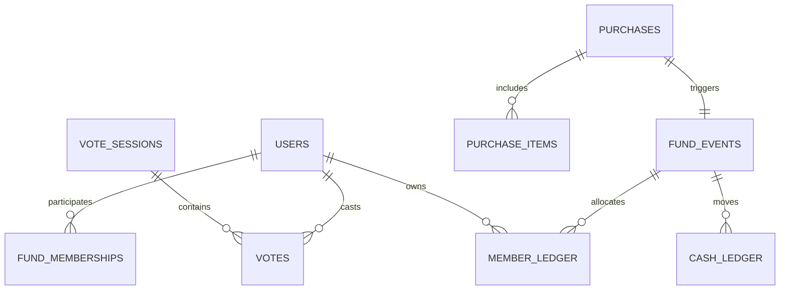

# Coffee 12A — Kiến trúc database (DBA)

**Phiên bản:** 2.2 · **Ngày:** 24/09/2026 · **Trạng thái:** Đã chốt quy tắc chia đều cho toàn bộ thành viên quỹ

## 1. Nguyên tắc hạch toán

PostgreSQL; ID `uuid`; tiền `bigint` VND; thời gian `timestamptz` UTC, hiển thị `Asia/Ho_Chi_Minh`. Hai số quan trọng:

- **Tiền quỹ thực (`cash_ledger`)**: tiền mặt/chuyển khoản quỹ đã nhận/trả. Phiếu do cá nhân trả không đi qua quỹ.
- **Số dư theo người (`member_ledger`)**: tiền nộp, tiền mua hộ được ghi có, phần quà được phân bổ, chi phí phải chia và tiền đã được quỹ hoàn. Số âm = cần nộp thêm, số dương = đã ứng/nộp dư. Không có giá theo cốc; vote không sinh ledger.

**Bất biến:** sau mọi giao dịch đã post, `SUM(member_ledger.amount_vnd) = SUM(cash_ledger.amount_vnd)`, giả định mọi khoản quỹ đều được ghi và phân bổ, tất cả người liên quan vẫn có hàng ledger kể cả đã rời nhóm. Cho phép tổng quỹ âm trên sổ nếu quỹ ghi chi vượt thu, nhưng phải ghi rõ nguồn tiền thực tế khi đối soát.

## 2. Quan hệ

`FUND_EVENTS` là một nghiệp vụ thu/chi/mua hộ/quà/hoàn tiền; ledger con ghi từng tác động có dấu. Phiếu mua có thể được trả bởi quỹ hoặc thành viên.

## 3. Bảng và ràng buộc

| Bảng | Cột chính |
|---|---|
| `users` | `id uuid PK`, `employee_code UNIQUE`, `username UNIQUE` không phân biệt hoa thường, `display_name`, `password_hash`, `role MEMBER/ADMIN`, `status ACTIVE/DISABLED`, timestamps. |
| `fund_memberships` | `id PK`, `user_id FK`, `starts_at`, `ends_at NULL`, `created_by FK`, `created_at`; cấm khoảng thời gian tham gia chồng lắp của cùng người. Không xóa lịch sử. Người mua hộ phải có membership tại thời điểm phiếu trong MVP. |
| `fund_events` | `id PK`, `kind DEPOSIT/GIFT/PURCHASE_FUND/PURCHASE_MEMBER/REIMBURSEMENT/REVERSAL`, `amount_vnd bigint >0`, `occurred_at`, `actor_user_id FK`, `subject_user_id FK NULL` (người nộp/mua hộ/nhận hoàn), `external_ref NULL`, `status POSTED/REVERSED`, `reverses_event_id FK NULL`, `reason NULL`, `created_at`, `import_job_id FK NULL`. Dòng đảo có thể dùng cùng bảng nhưng hạch toán ledger con ngược dấu; không thay event gốc. |
| `purchases` | `id PK`, `fund_event_id FK UNIQUE`, `external_ref UNIQUE`, `purchased_at`, `paid_by FUND/MEMBER`, `payer_user_id FK NULL`, `shop NULL`, `total_amount_vnd bigint >0`, `notes NULL`; kiểm tra `paid_by` khớp `fund_events.kind` và người trả. |
| `purchase_items` | `id PK`, `purchase_id FK`, `item_name`, `quantity numeric(18,3) NULL`, `unit NULL`, `line_amount_vnd bigint >=0`; tổng dòng đúng tổng phiếu, kiểm tra lúc post. Không có tồn kho. |
| `cash_ledger` | `id PK`, `event_id FK`, `amount_vnd bigint <>0`, `occurred_at`, `created_at`; một event có **0 hoặc 1** dòng cash cho nghiệp vụ gốc: DEPOSIT +x, GIFT +x, PURCHASE_FUND −x, PURCHASE_MEMBER 0 dòng, REIMBURSEMENT −x. Event đảo ghi dòng đối ứng nếu event gốc có cash. Unique `(event_id)` khi có dòng. |
| `member_ledger` | `id PK`, `event_id FK`, `user_id FK`, `entry_type DEPOSIT_CREDIT/GIFT_SHARE/PURCHASE_SHARE/PURCHASE_CREDIT/REIMBURSEMENT_DEBIT/REVERSAL`, `amount_vnd bigint <>0`, `occurred_at`, `created_at`; một event có nhiều dòng. Dòng đảo liên kết dòng gốc hoặc event gốc để audit. |
| `vote_sessions` | `id PK`, `name`, `service_date date`, `opens_at`, `cutoff_at`, `planned_brew_at NULL`, `status DRAFT/OPEN/CLOSED/CANCELLED`, `created_by FK`, timestamps; nhiều đợt/ngày. |
| `votes` | `id PK`, `vote_session_id FK`, `user_id FK`, `choice YES/NO`, `coffee_type MACHINE/PHIN/UNDECIDED NULL`, `cups int NULL CHECK (>0)`, `is_withdrawn bool`, `note NULL`, timestamps, `UNIQUE(vote_session_id,user_id)`. |
| `import_jobs`, `report_exports`, `audit_events` | Mã nguồn, file/checksum, người thao tác, thời gian, trạng thái/lỗi, lý do và filter báo cáo; không lưu mật khẩu/token. |

Tất cả FK sổ dùng `ON DELETE RESTRICT`. `occurred_at` là ngày nghiệp vụ, `created_at` là lúc nhập thật. Không cho sửa/xóa trực tiếp ledger đã post. Event gốc và đảo cùng được giữ để đối soát.

## 4. Posting rules và chia đều

Trong **một DB transaction**: khóa event/idempotency; xác định danh sách `fund_memberships` có `starts_at <= occurred_at < ends_at` hoặc `ends_at IS NULL`, **không lọc theo `votes`**; sắp theo `users.employee_code`, phụ theo `users.id`; chụp danh sách bằng các dòng phân bổ trong member ledger; ghi cash/member ledger; kiểm `SUM(member deltas)=SUM(cash deltas)` trước commit. Người không vote hoặc vote NO vẫn nằm trong phép chia nếu đang tham gia quỹ.

| Loại event, số tiền x | Dòng cash | Dòng member |
|---|---:|---|
| `DEPOSIT` do U nộp | `+x` | U `+x` |
| `GIFT` quỹ nhận | `+x` | Chia `+x` cho N thành viên |
| `PURCHASE_FUND` | `−x` | Chia `−x` cho N thành viên |
| `PURCHASE_MEMBER` do U tự trả | Không có | Chia `−x` cho N thành viên, U `+x` mua hộ |
| `REIMBURSEMENT` quỹ trả U | `−x` | U `−x` |
| `REVERSAL` | Đảo đúng dòng cash gốc nếu có | Đảo từng dòng member gốc theo cùng người/loại, không chia lại theo N hiện tại |

Quy tắc chia: `q = floor(x/N)`, `r = x mod N`; `r` người đầu theo thứ tự mã ổn định nhận thêm 1 VND. Áp dụng dấu + với GIFT, dấu − với PURCHASE. N phải >0; nếu không có thành viên thì chặn post GIFT/PURCHASE và yêu cầu quản trị thiết lập nhóm. Người mua hộ U có trong tập N; vừa nhận `+x`, vừa chịu phần chia. Nếu muốn xử lý người mua không tham gia quỹ, cần nghiệp vụ mới.

**Không gộp `PURCHASE_MEMBER` vào tiền nộp mặt:** nó có tổng cash =0 và tổng member = `−x + x = 0`. Cách này cho phép số dư U tăng và người khác âm đúng mức. Phiếu quỹ trả giảm cash và member cùng x. Bút toán đảo tạo event mới, FK `reverses_event_id UNIQUE` để chỉ đảo một lần; đặt `status=REVERSED` cho event gốc trong cùng transaction, nhưng vẫn giữ mọi ledger và tính tổng cả gốc + đảo. Chống request lặp bằng `external_ref`/idempotency key duy nhất theo nguồn và loại.

Ví dụ A/B/C nộp mỗi người 30.000; quỹ mua 90.000; A mua hộ 60.000 → cash 0, member A +40.000, B/C −20.000. Gift 30.000 → cash 30.000; A +50.000, B/C −10.000; tổng member 30.000.

## 5. Vote, báo cáo, Excel

Vote một dòng/người/đợt, YES/NO, sửa/rút khi `status='OPEN' AND now()<cutoff_at`. Chốt phải đồng bộ với thao tác vote bằng khóa hoặc cập nhật điều kiện. Kết quả là `COUNT(YES)`, `SUM(cups)` theo máy/phin; **không** tạo fund event. Sau đợt sáng có thể tạo đợt mới cùng ngày.

Báo cáo theo kỳ `[from,to)` trong giờ Việt Nam: số dư quỹ đầu/cuối và số dư từng người đầu/cuối từ ledger theo `occurred_at`; nhóm member ledger theo loại để giải thích số âm; quà và phiếu mua hiển thị riêng. Không lấy tổng `purchases.total_amount_vnd` cộng thêm vào cash ledger khi tính tiền. Nên có truy vấn đối soát `SUM(member_ledger.amount_vnd) - SUM(cash_ledger.amount_vnd)=0` và đối soát theo từng event; cảnh báo nếu sai, không tự sửa.

Index: `fund_memberships(user_id,starts_at,ends_at)` và exclusion constraint chống chồng khoảng; `fund_events(occurred_at,kind)`, unique `(reverses_event_id)` khi có giá trị; `cash_ledger(event_id)`, `(occurred_at,id)`; `member_ledger(user_id,occurred_at,id)`, `(event_id)`; `purchases(external_ref)`; `vote_sessions(status,cutoff_at)`, `(service_date,opens_at)`; `votes(vote_session_id,user_id)`.

Excel import: người tham gia/quyền, tiền nộp, tiền cho thêm, mua đồ (nhiều mặt hàng/mã phiếu), hoàn tiền. Preview **danh sách và mức chia đã tính**, lỗi từng dòng, rồi post nguyên khối hoặc rollback. Khi xác nhận phải tính lại tập thành viên và preview nếu có thay đổi so với lúc xem; không ghi phân bổ khác bản đã được xác nhận. Chống trùng `external_ref`. Excel xuất các sheet `Tong_quan`, `So_du_theo_nguoi`, `Tien_nop`, `Tien_cho_them`, `Mua_do_va_phan_bo`, `Vote`; admin mới được xuất dữ liệu từng người.

## 6. Bảo mật và kiểm thử

Admin cấp tài khoản, mật khẩu hash chuyên dụng, giới hạn thử đăng nhập. Thành viên chỉ đọc số dư/lịch sử của mình; admin mới post ledger; không đưa DB service key lên frontend. Backup và thử khôi phục. Nhật ký thao tác và lý do bắt buộc khi đảo giao dịch.

Kiểm thử: chia 100 VND cho 3 người theo thứ tự → 34/33/33, trong đó một người không vote vẫn nhận phần chia; mua bằng quỹ/mua hộ khi số dư 0; quà; hoàn tiền; thành viên mới vào/ra không thay phân bổ cũ; người mua hộ cũng nằm trong tập chia; import trùng; chốt vote đồng thời; đảo phiếu mua sau khi tập thành viên đổi; mọi tình huống bảo toàn tổng member = cash. Dùng ví dụ 3 người/90.000/60.000/30.000 ở trên để đối soát số cụ thể.

## 7. Quyết định BA cần xác nhận

**Đã chốt:** chia đều cho toàn bộ người tham gia quỹ tại thời điểm mua/nhận quà, không căn cứ phiếu vote và không tính theo số cốc. Còn cần chốt danh sách thành viên quỹ, ngày bắt đầu/kết thúc, quyền xem quỹ và việc cá nhân mua hộ có cần admin duyệt trước khi post hay không.
