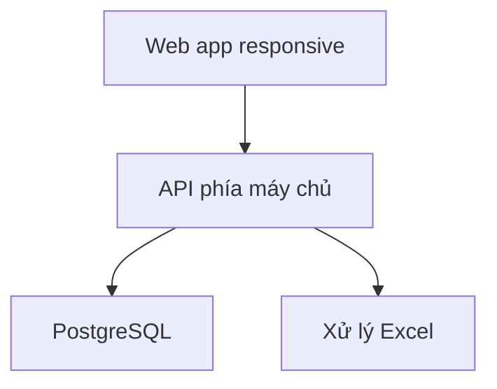

# Coffee 12A — Kế hoạch phát triển web app

**Phiên bản:** 1.0 · **Ngày:** 25/09/2026  
**Đầu vào:** `Coffee12A_BA_Business_Requirements.md` v2.2 và `Coffee12A_DBA_Database_Architecture.md` v2.2  
**Mục tiêu hiển thị:** desktop từ **1366×768**; responsive mobile xuống **375×667 CSS px** (mốc iPhone 8).  
**Định hướng:** một web app cho thành viên và quản trị; tài khoản được quản trị cấp sẵn, không đăng ký công khai.

## 1. Phạm vi bản đầu

| Module | Thành viên | Quản trị |
|---|---|---|
| Đăng nhập | Đăng nhập, đổi mật khẩu, đăng xuất | Cấp/khóa/đặt lại tài khoản; phân vai trò |
| Vote pha chung | Xem đợt, vote/sửa/rút trước chốt, xem kết quả | Mở/chốt/hủy đợt, xem kết quả, tạo nhiều đợt/ngày |
| Quỹ | Xem số dư và lịch sử của mình; xem tổng quỹ nếu bật quyền | Ghi tiền nộp, tiền được cho thêm, hoàn tiền, đối soát |
| Mua đồ | Không sửa phiếu; xem phần chi phí phân bổ của mình | Ghi phiếu mua nhiều món, chọn quỹ trả/cá nhân mua hộ, xem trước phần chia, post/đảo giao dịch |
| Thống kê | Số cần nộp thêm hoặc đã ứng; lịch sử phần chia | Số dư mọi người, thu–chi, mua hộ, quỹ thực, kết quả vote |
| Excel | Không truy cập | Tải mẫu, xem trước nhập, xác nhận nhập, xuất báo cáo `.xlsx` |

**Đã chốt:** mọi khoản mua và tiền được cho thêm chia đều cho **toàn bộ thành viên đang tham gia quỹ ở thời điểm giao dịch**, kể cả người không vote/không uống. Vote không thu tiền; số dư cá nhân âm là số cần nộp thêm. Người tự mua đồ chung được ghi có toàn bộ tiền đã trả, đồng thời chịu phần chia của mình. Không làm công thức nguyên liệu, tồn kho, tính tiền/cốc, pha lẻ, blog ở bản này.

## 2. Kiến trúc triển khai đề xuất



- **Một codebase web:** đề xuất Next.js + TypeScript. Trang thành viên và `/admin` dùng chung đăng nhập, layout và bộ component; chức năng admin kiểm quyền trên máy chủ, không chỉ ẩn nút.
- **API cùng ứng dụng web:** xử lý xác thực, vote, các lệnh post tài chính, báo cáo và Excel ở phía máy chủ. Frontend không truy cập bảng tài chính trực tiếp. Lưu DB trên PostgreSQL (có thể dùng Supabase làm dịch vụ quản lý DB), deploy web/API trên Vercel nếu chọn hướng triển khai đó. Đây là đề xuất cho Coffee 12A, không mặc nhiên tái dùng tài liệu hạ tầng của dự án khác.
- **Đăng nhập:** admin tạo user trong DB; hash mật khẩu với thuật toán dành cho password; buộc đổi mật khẩu lần đầu; phiên đăng nhập bằng cookie `HttpOnly`, `Secure`, `SameSite` thích hợp; giới hạn thử đăng nhập, CSRF protection cho các lệnh thay đổi dữ liệu. Không hardcode username/password trong frontend hoặc lưu mật khẩu rõ trong DB/Excel.
- **Giao dịch tiền:** database transaction cho `fund_events`, `cash_ledger`, `member_ledger`, phiếu mua và các dòng món. Idempotency key cho thao tác post/import; DB constraints và quyền truy cập chặn post trùng. Chạy đối soát `SUM(member_ledger) = SUM(cash_ledger)` sau mỗi giao dịch.
- **Quy mô:** ưu tiên truy vấn có index và phân trang, chưa cần cache phân tán/queue. Báo cáo Excel tạo theo yêu cầu ở phía máy chủ, giới hạn khoảng lọc/số dòng để tránh timeout. Nếu dữ liệu vượt giới hạn thì bổ sung tác vụ nền ở giai đoạn sau.

### Cấu trúc mã tham khảo

```text
src/
  app/
    (auth)/login/
    (member)/votes/  (member)/my-balance/
    admin/users/  admin/memberships/  admin/votes/
    admin/fund/  admin/purchases/  admin/reports/  admin/import-export/
    api/
  components/
  features/auth/  features/votes/  features/fund/  features/purchases/
  lib/db/  lib/security/  lib/excel/
db/migrations/
tests/
```

Các đường dẫn là gợi ý tổ chức mã; dev có thể dùng framework tương đương nếu vẫn đáp ứng API/transaction/quyền và responsive.

## 3. Hợp đồng dữ liệu/API tối thiểu

| Nhóm | Thao tác |
|---|---|
| Auth | `POST /api/login`, `POST /api/logout`, `GET /api/me`, `POST /api/change-password` |
| Vote | `GET /api/vote-sessions`, `GET /api/vote-sessions/:id`, `PUT /api/vote-sessions/:id/my-vote`, `DELETE /api/vote-sessions/:id/my-vote`; admin tạo/chốt/hủy |
| Quỹ cá nhân | `GET /api/me/balance`, `GET /api/me/ledger?from&to&page`; không trả ledger người khác |
| Quản trị | CRUD tài khoản/membership; `POST /api/admin/fund/deposits`, `/gifts`, `/reimbursements`; `POST /api/admin/purchases`; `POST /api/admin/fund-events/:id/reverse` |
| Báo cáo/Excel | `GET /api/admin/reports/overview`, `/members`, `/purchases`, `/votes`; `POST /api/admin/imports/preview`, `/imports/:id/commit`, `GET /api/admin/exports?type&from&to` |

API mutations dùng schema validation, trả lỗi có mã ổn định (`INVALID_INPUT`, `VOTE_CLOSED`, `DUPLICATE_REFERENCE`, `MEMBERSHIP_CHANGED`, `INSUFFICIENT_PERMISSION`). Server lấy `user_id` từ phiên đăng nhập, không tin `user_id` do client gửi cho thao tác của tôi. API tiền chỉ dùng số nguyên VND, timestamp ISO 8601 có múi giờ; nhập ngày chỉ được quy đổi thành UTC một lần. Lệnh post có idempotency key và kiểm tra quyền admin.

**Khi post mua đồ:** chụp danh sách thành viên hiệu lực tại `occurred_at`; xem trước phiếu, tổng tiền, N thành viên và mức chia từng người; lúc xác nhận nếu danh sách/thời điểm/phiếu thay đổi thì trả lỗi và yêu cầu xem trước lại. Người mua hộ phải là thành viên đang tham gia theo thiết kế DBA hiện tại. Chia `x = q×N+r` theo thứ tự mã thành viên ổn định: `r` người đầu nhận phần chênh 1 VND. Đảo phiếu dựa trên dòng phân bổ gốc, không chia lại theo thành viên hiện tại.

## 4. Kế hoạch giao diện và responsive

### Breakpoint và nguyên tắc

- **1366×768:** layout desktop tối thiểu có thanh điều hướng bên, vùng nội dung chính, bảng có filter/pagination và nút hành động nhìn thấy mà không cần cuộn ngang toàn trang. Không cố nhét mọi cột: bảng lớn cho chọn cột hoặc trang chi tiết.
- **375×667 CSS px:** một cột, thanh điều hướng thu gọn/bottom navigation phù hợp số mục; card thay bảng nhiều cột, filter trong panel/drawer, nút hành động chính dễ chạm, form có label và lỗi ngay dưới ô. Cho cuộn dọc; không có cuộn ngang toàn trang. Riêng bảng preview Excel nhiều cột có thể cuộn ngang **trong vùng bảng** và có tóm tắt lỗi theo dòng.
- **Khoảng giữa:** kiểm tra thêm 768×1024 (tablet) và 390×844 để phát hiện điểm gãy. Breakpoint triển khai theo độ rộng nội dung, không dùng user agent/iPhone detection. Dùng viewport `width=device-width, initial-scale=1`.
- **Tương tác:** vùng chạm tối thiểu khoảng 44×44 CSS px cho nút quan trọng, chữ thân dễ đọc (mốc 16 px trên mobile), trạng thái focus rõ, hỗ trợ bàn phím desktop. Không yêu cầu thao tác hover để xem thông tin thiết yếu; tương phản đủ đọc; thông báo lỗi dưới field và thông báo tổng cho form.
- **Chiều cao 667:** kiểm tra trạng thái Safari có thanh trình duyệt và bàn phím mở: nút xác nhận không bị che, modal có thể cuộn bên trong, biểu mẫu dài không khóa phần cuối. Kiểm tra cả phóng to chữ ở mức hợp lý và chuỗi tên dài/tiền âm.

### Bảng màn hình

| Màn hình | Desktop 1366×768 | Mobile 375×667 |
|---|---|---|
| Vote đang mở | Danh sách đợt và chi tiết cạnh nhau khi đủ chỗ | Card đợt → trang chi tiết, CTA vote rõ trên đầu/dưới |
| Kết quả vote | Tổng cốc/người + nhóm máy/phin | KPI xếp dọc, danh sách gọn |
| Số dư của tôi | KPI, lịch sử ledger dạng bảng | KPI và dòng lịch sử theo card; âm màu/nhãn rõ, không chỉ dựa vào màu |
| Admin mua đồ | Form và preview chia chi phí cùng màn | Form nhiều bước: thông tin → món → preview người được chia → xác nhận |
| Admin quỹ | KPI và bộ lọc/bảng giao dịch | KPI dọc, filter thu gọn, giao dịch dạng card |
| Admin Excel | Upload, lỗi theo dòng, preview bảng | Upload và danh sách lỗi ưu tiên; preview bảng cuộn trong vùng riêng |

Chụp ảnh/ghi nhận QA tối thiểu cho 6 màn hình trên ở cả 1366×768 và 375×667. Kiểm tra trên Safari iPhone 8 thật hoặc thiết bị tương đương khi có thể; trình giả lập không thay thế hoàn toàn kiểm thử bàn phím/chạm.

## 5. Các giai đoạn thực hiện

Ước lượng **một dev full stack, BA/DBA review theo mốc**, chưa tính chờ duyệt/thiết kế thương hiệu. Đây là kế hoạch tương đối, không phải cam kết ngày giao hàng.

| Giai đoạn | Công việc | Kết quả kiểm tra | Ước lượng |
|---|---|---|---:|
| 0. Chốt nghiệp vụ | Danh sách thành viên ban đầu, ngày hiệu lực, quyền xem quỹ, quy trình xác nhận mua hộ, mẫu Excel, nhãn trên UI | BA duyệt ví dụ và ca biên | 1–2 ngày |
| 1. Nền tảng | Repo, môi trường dev/staging, migrations, seed admin, auth/roles, layout desktop/mobile, CI cơ bản | Login/đổi mật khẩu và route admin có phân quyền | 3–5 ngày |
| 2. Vote | Đợt vote, phiếu cá nhân, chốt, kết quả, nhiều đợt/ngày | Vote trước/sau hạn đúng; responsive | 2–3 ngày |
| 3. Sổ quỹ | Membership, posting deposit/gift, ledger và số dư, đối soát | Tiền vào đúng quỹ và từng người | 3–4 ngày |
| 4. Mua và phân bổ | Phiếu nhiều món, quỹ/cá nhân trả, preview, chia dư, đảo phiếu, hoàn tiền | Ví dụ A/B/C và invariant DB đúng | 4–6 ngày |
| 5. Báo cáo/Excel | Lọc theo kỳ, số dư đầu/cuối, số âm, mẫu import, preview, xuất `.xlsx` | Không ghi trùng/lỗi một phần; các sheet đúng | 4–6 ngày |
| 6. Hoàn thiện | QA responsive, bảo mật, test trên trình duyệt/thiết bị, staging, hướng dẫn admin, backup, triển khai | Checklist nghiệm thu hoàn tất | 3–5 ngày |

**Tổng tham khảo: 20–31 ngày làm việc (~4–6 tuần)** cho một dev nếu dữ liệu đầu vào, review và môi trường có sẵn. Trường hợp UX riêng, thay đổi cách chia quỹ hoặc xử lý nhập Excel phức tạp sẽ làm tăng thời gian.

## 6. Kiểm thử có ý nghĩa và tiêu chí nghiệm thu

### Tự động hóa tối thiểu

- **Unit:** phép chia 100 VND cho 3 người → 34/33/33; người không vote vẫn chịu phần; quỹ trả/cá nhân trả/gift/hoàn tiền; số dư âm; đảo phiếu sau khi nhóm thành viên thay đổi.
- **Integration với DB thật:** cùng lúc hai lần post một idempotency key chỉ ghi một event; post phiếu hai món tạo một event/cash phù hợp; tổng member ledger = cash ledger sau mỗi loại event; membership hiệu lực theo `occurred_at`; rollback khi một dòng sai; người thường không đọc số dư của người khác.
- **End to end:** admin tạo tài khoản → thành viên login/vote → admin ghi nộp quỹ/mua đồ/gift → người dùng thấy số cần nộp → admin xuất Excel; chạy luồng chính ở desktop và mobile.

### Cổng nghiệm thu

1. 1366×768 và 375×667 không có cuộn ngang toàn trang, không mất nút xác nhận, không có chữ/bảng đè lên nhau.
2. Thử Safari iPhone 8 hoặc viewport 375×667 với thao tác chạm, mở bàn phím, cuộn form, định dạng số VND và các thông báo lỗi.
3. Ví dụ A/B/C trong tài liệu BA ra đúng A +50.000, B/C −10.000 và quỹ 30.000 sau gift; thành viên không uống vẫn được chia.
4. Mỗi event đã post đối soát về 0; không có duplicate khi refresh/gửi lại hoặc import lại.
5. Người không có quyền admin không xem báo cáo theo người/không post tiền bằng cách gọi API trực tiếp.
6. Vote đã chốt không sửa được; vote không thay đổi quỹ; có thể tạo đợt thứ hai trong ngày.
7. File Excel xuất mở được và tổng theo kỳ khớp DB; file nhập sai không ghi một phần; số dư đầu kỳ tính đúng.

## 7. Dữ liệu ban đầu, triển khai và bàn giao

1. Chuẩn bị danh sách tài khoản/mã nhân viên và thành viên quỹ với ngày bắt đầu; quản trị xác nhận trước khi seed. Tài khoản ban đầu buộc đổi mật khẩu. Nếu quỹ đã tồn tại, nhập tiền mở sổ theo quy tắc được BA/DBA duyệt; không tự phân bổ lại lịch sử chưa biết.
2. Có môi trường **dev**, **staging**, **production** riêng, secret tách biệt. Chạy migrations có thể rollback có kiểm soát; kiểm tra backup/restore trên staging trước khi chuyển dữ liệu thật. Không đưa file chứa mật khẩu hay dữ liệu tài chính thật vào repo.
3. Staging chạy bộ nghiệm thu bằng dữ liệu mẫu; admin kiểm tra màn hình 1366×768 và iPhone 8, mẫu Excel, ví dụ đối soát; sửa lỗi trước khi phát hành.
4. Production: deploy có đường quay lại phiên bản ứng dụng trước; sau phát hành kiểm tra login, vote, ghi tiền thử có kiểm soát, đối soát và xuất báo cáo. Giao tài liệu thao tác admin, mô tả phân quyền, cách nhập Excel và xử lý giao dịch sai.

## 8. Quyết định còn mở trước khi bắt đầu code

- Danh sách ban đầu và ngày có hiệu lực của người tham gia quỹ.
- Thành viên có được xem **tổng số tiền quỹ** hay chỉ số dư của mình.
- Cá nhân mua hộ có gửi đề nghị kèm hóa đơn trên web không, hay admin tự nhập sau khi kiểm tra (MVP đề xuất admin nhập).
- Phương án nhập số dư/quỹ ban đầu nếu đã mua và góp tiền trước khi dùng app.

Các quyết định này không thay đổi quy tắc **chia đều cho tất cả thành viên quỹ, kể cả người không uống** đã chốt.

## 9. Tài liệu tham khảo kỹ thuật

- Apple Developer, kích thước iPhone 8: <https://developer.apple.com/library/archive/documentation/DeviceInformation/Reference/iOSDeviceCompatibility/Displays/Displays.html> (375×667 điểm/750×1334 pixel vật lý).
- Next.js, viewport và metadata: <https://nextjs.org/docs/app/getting-started/metadata-and-og-images>.
- Vercel, triển khai Next.js: <https://vercel.com/docs/frameworks/full-stack/nextjs>.
- Supabase, bảo vệ dữ liệu và Row Level Security khi mở quyền truy cập trực tiếp: <https://supabase.com/docs/guides/database/postgres/row-level-security>.
